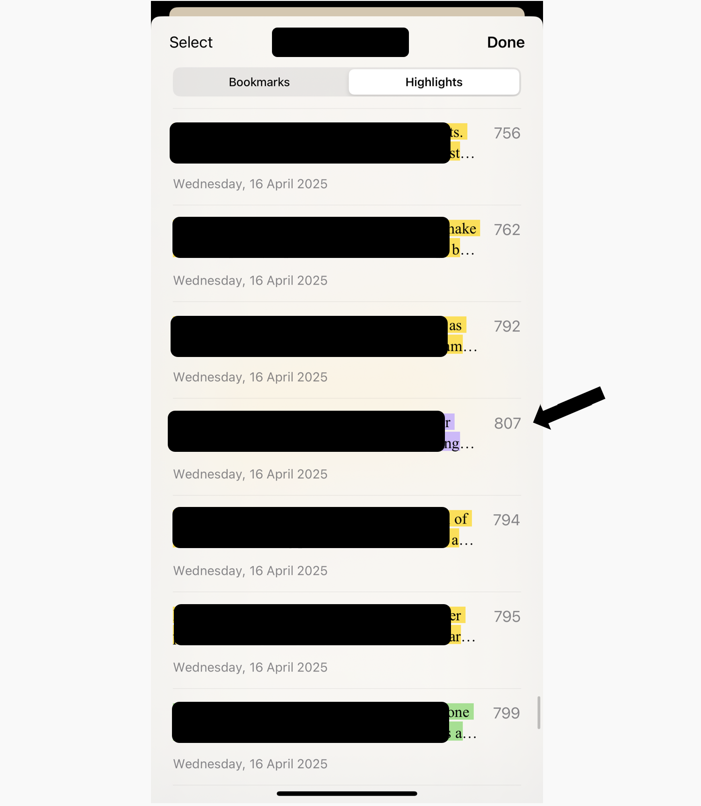

## iphone books highlights fixer

Fix iphone bug: book highlights order (on the default **Books** app). 

when exporting, many highlights are not in order (my expected order: by page num) on each chapter. it's been like that for many years now, so obviously it's not on anyone's backlog.

for me, this bug happens with imported books all the time. i like the app too much to leave (unless they ever change the mass exporting again).



Assumptions:
- poor windows user with no other way to sync notes aside from mass exporting them
- epub file is on pc running this script (for sorting and adding chapter titles)
- highlights seperated by new lines

Run:

1. `pip install beautifulsoup4`
2. copy exported book highlights to `notes_data.py`. also fill in book path.
3. run `notes_from_book.py`

Result:

printed like so:

```
chapter name

highlight1
highlight2
...

chapter name
...
```

works for me